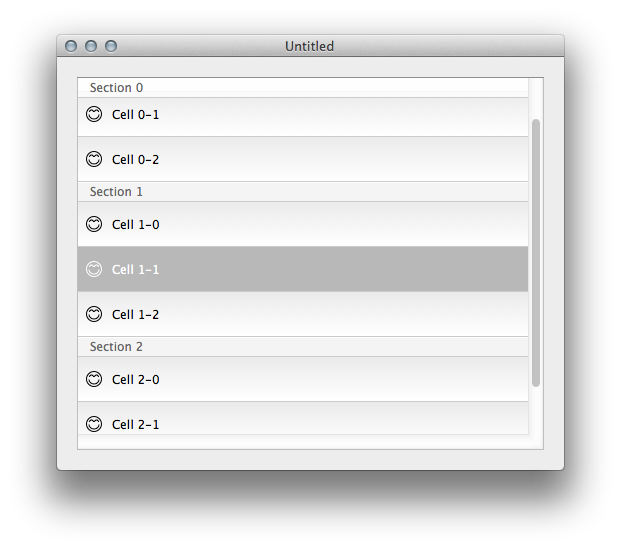

TBTableView
===========

TBTableView is a view-based table view working with Mac OS X.6 (Snow Leopard) created for [Tea Box](http://www.lisacintosh.com/tea-box) application.

This table view supports:

* Cells background and selection customization
* Drag & Drop
* Live editing of cells and section headers
* And other stuff

_Note: This project can be used for pre-Mac OS X.7 (Lion) application to support table view with view-based cells; Apple introduces in Lion and later this kind of table view, so I can only recommend to use what they provide, more robust and less buggy!_

I've created this application in febuary 2013 and I release the code source and resources on MIT Licence.

_Xcode 4.6+ and Mac OS X.6 required._

[Download Tea Box](http://lisacintosh.com/tea-box/)

[Lisacintosh.com](http://lisacintosh.com/), 2014